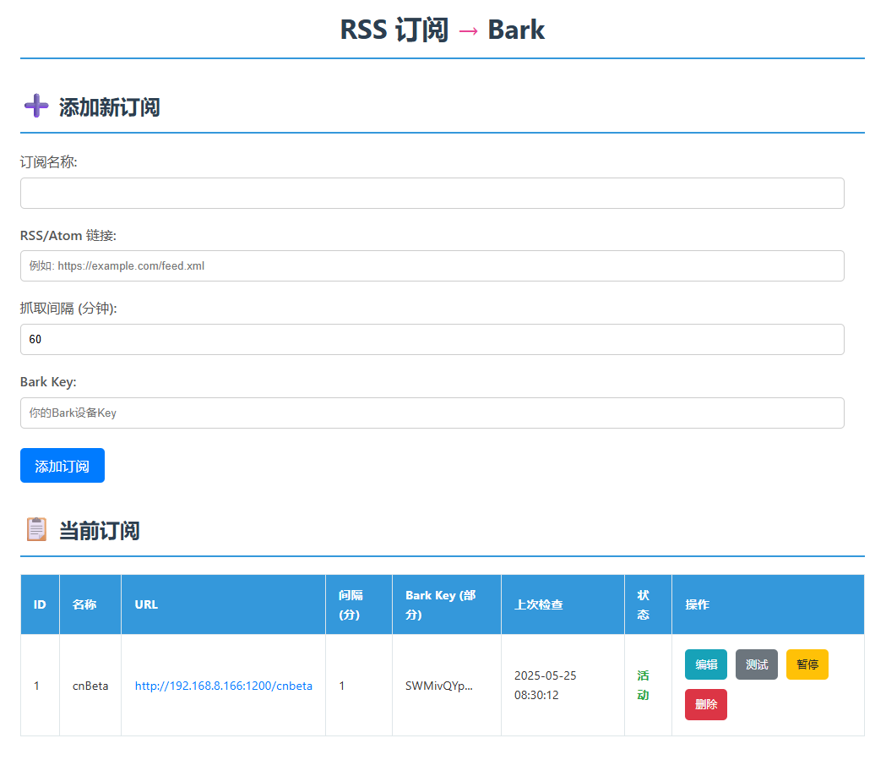
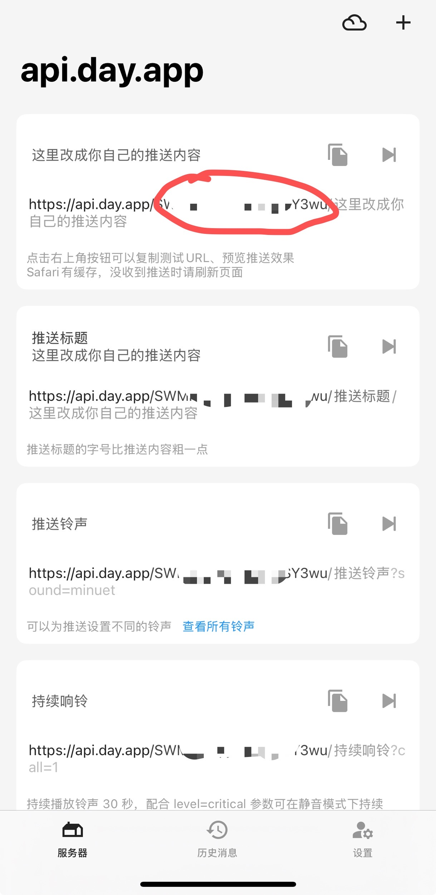
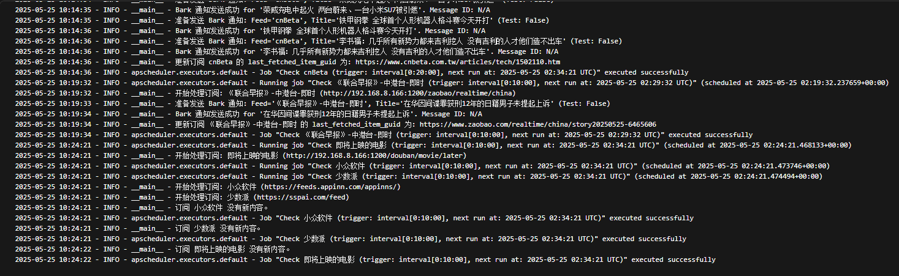

## 项目介绍

这是一个用来定时监控RSS更新，并调用bark推送的web应用，配合IOS端使用可以做到系统级推送。

*   可以为每个订阅设置检查的时间间隔
*   搭配RSShub食用更佳

### 网页预览效果如下：


### 推送效果如下：


### Bark key:


### 可以查看任务日志：


## 使用方式如下：

1.  **拉取本仓库：**
    ```bash
    git clone https://github.com/xiexianghua/rss_bark_pusher.git
    cd rss_bark_pusher/
    ```

2.  **编译docker镜像：**
    ```bash
    docker build -t rss-bark-pusher .
    ```

3.  **运行容器：**
    ```bash
    docker run -d --restart always -p 5000:5000 --name my-rss-pusher -v /root/rss_mine:/app/data rss-bark-pusher:latest
    ```
    **说明：** `/root/rss_mine` 为你的数据库存放位置，可自定义。

4.  **查看日志：**
    ```bash
    docker logs my-rss-pusher
    ```