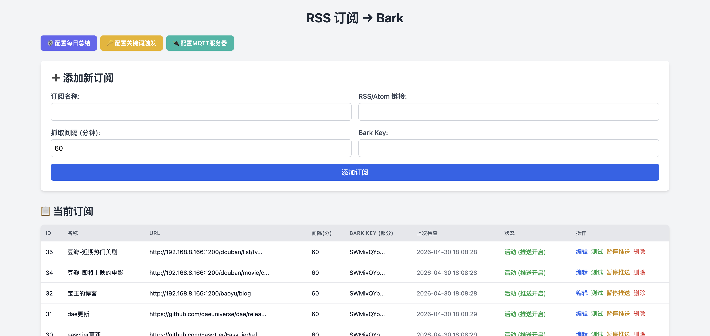
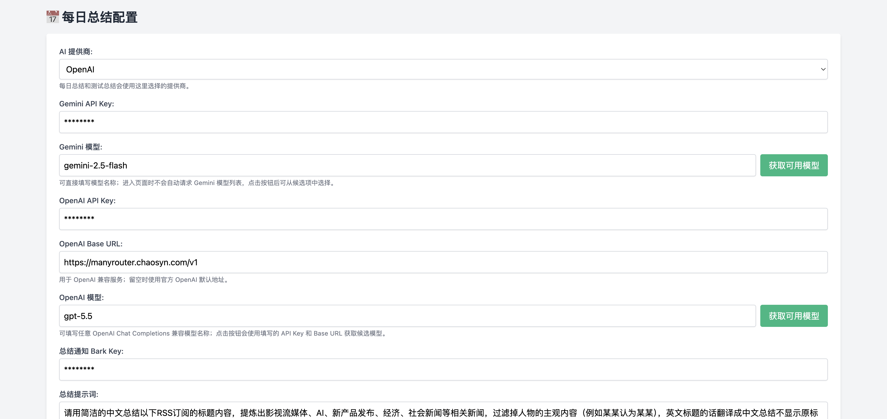
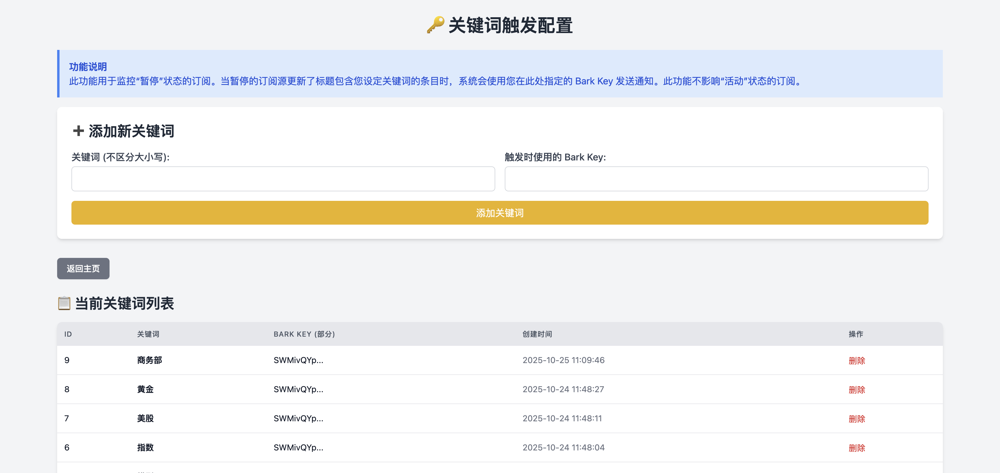
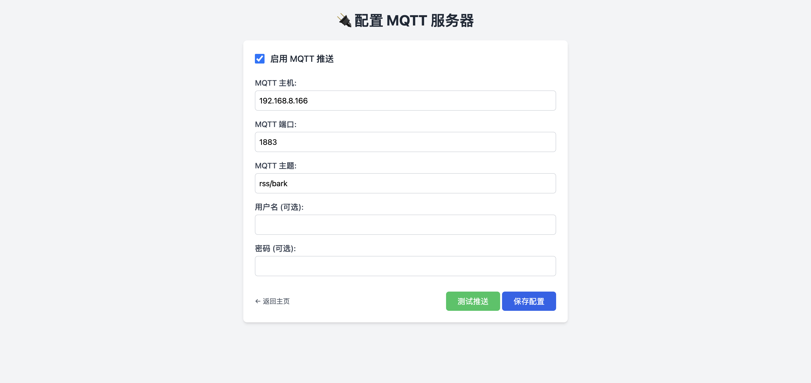
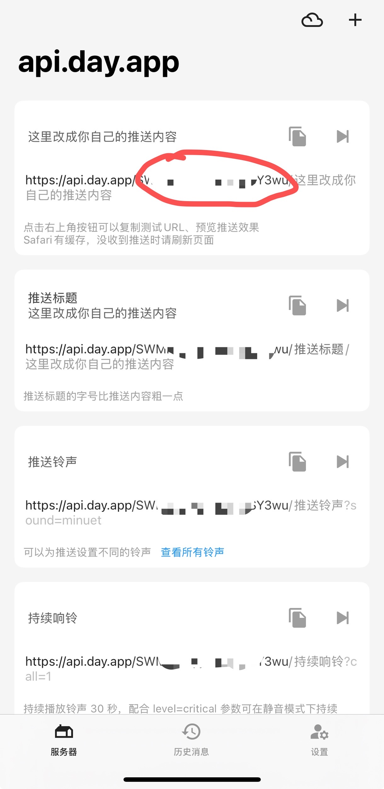
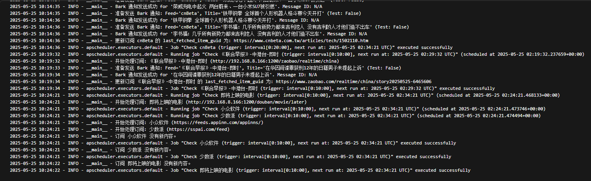

## 项目介绍

这是一个用来定时监控RSS更新，并调用bark推送的web应用，配合IOS端使用可以做到系统级推送。

*   可以为每个订阅设置检查的时间间隔
*   搭配RSShub食用更佳

### 网页预览效果如下：

#### RSS 订阅管理首页


#### 每日总结配置


#### 关键词触发配置


#### MQTT 服务器配置


### 推送效果如下：


### Bark key:


### 可以查看任务日志：


## 使用方式如下：

1.  **拉取本仓库：**
    ```bash
    git clone https://github.com/xiexianghua/rss_bark_pusher.git
    cd rss_bark_pusher/
    ```

2.  **编译docker镜像：**
    ```bash
    docker build -t rss-bark-pusher .
    ```

3.  **运行容器：**
    ```bash
    docker run -d --restart always -p 5000:5000 --name my-rss-pusher -v /root/rss_mine:/app/data rss-bark-pusher:latest
    ```
    **说明：** `/root/rss_mine` 为你的数据库存放位置，可自定义。

4.  **查看日志：**
    ```bash
    docker logs my-rss-pusher
    ```

## 每日总结 AI 配置

进入网页后点击「配置每日总结」，可以选择使用 Gemini 或 OpenAI 生成 RSS 每日总结。

*   **Gemini：**填写 Gemini API Key 和 Gemini 模型名称；默认模型为环境变量 `GEMINI_MODEL_NAME`，未设置时使用 `gemini-2.5-flash`。页面中的「获取可用模型」按钮可按需拉取 Gemini 模型列表。
*   **OpenAI：**填写 OpenAI API Key 和 OpenAI 模型名称；默认模型为环境变量 `OPENAI_MODEL_NAME`，未设置时使用 `gpt-4o-mini`。如需使用 OpenAI 兼容服务，可填写 OpenAI Base URL；留空时使用官方 OpenAI 默认地址。页面中的「获取可用模型」按钮会使用当前填写或已保存的 OpenAI API Key，并结合 OpenAI Base URL 拉取兼容服务返回的模型列表。
*   **OpenAI 兼容服务示例：**OpenAI 官方地址可留空或填写 `https://api.openai.com/v1`；兼容服务可填写该服务提供的 Chat Completions 兼容入口，例如 `https://openrouter.ai/api/v1`、`https://api.deepseek.com` 或自托管网关地址，并配套填写对应 API Key 与模型名称。
*   无论选择哪个提供商，都需要填写总结通知 Bark Key、总结提示词和总结间隔。
*   当 AI 生成的每日总结或测试总结较长时，Bark 通知会自动拆分为多条推送，并在标题中标注分段序号，例如 `每日RSS总结 (1/3)` 或 `[测试] 每日RSS总结 (1/3)`。
*   从旧版本升级时，已有 Gemini API Key、Gemini 模型、OpenAI API Key、OpenAI 模型、提示词、间隔和 Bark Key 会继续保留；OpenAI Base URL 默认为空以继续使用官方 OpenAI 默认地址，AI 提供商默认设为 Gemini。
